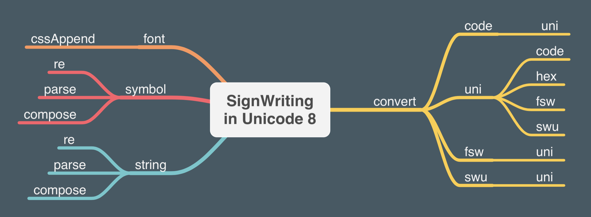

# @sutton-signwriting/unicode8

@sutton-signwriting/unicode8 is a javascript package for processing SignWriting in Unicode 8 (uni8) characters.  See [SignWriting#Unicode](https://en.wikipedia.org/wiki/SignWriting#Unicode) for more information.

This package also supports Formal SignWriting in ASCII (FSW) and SignWriting in Unicode (SWU) character sets.  See [draft-slevinski-formal-signwriting](https://tools.ietf.org/id/draft-slevinski-formal-signwriting-07.html) for detailed specification.

> Author: https://SteveSlevinski.me  
> Channel: https://www.youtube.com/channel/UCXu4AXlG0rXFtk_5SzumDow  
> Support: https://www.patreon.com/signwriting  

## Useful links

- Source: https://github.com/sutton-signwriting/unicode8
- Distribution: https://unpkg.com/browse/@sutton-signwriting/unicode8/
- Documentation: https://sutton-signwriting.github.io/unicode8/
- Issue Tracker: https://github.com/sutton-signwriting/unicode8/issues
- Online Discussion: https://gitter.im/sutton-signwriting/community

## Types of files
The source is written in small ES Modules available in the `src` directory along with the associated tests.

The distribution is available in three flavors.  Minified, the whole library is 2 KB in size.
* .js - Universal Module Definition
* .cjs - CommonJS
* .mjs - ES Module 

## Installation

### Download and Install with NPM

    npm install @sutton-signwriting/unicode8

## Developer Installation

### Download from GitHub and Install Development Dependencies

    wget https://github.com/sutton-signwriting/unicode8/archive/master.zip
    unzip master.zip
    cd unicode8-master
    npm install

## Usage

### Using in Node

    // import entire library
    const unicode8 = require('@sutton-signwriting/unicode8');

    // import individual module
    const unicode8Symbol = require('@sutton-signwriting/unicode8/symbol');

### Using in the Browser

#### Local files
    // import entire library
    // available as ssw.unicode8
    

    // import individual module
    // available as ssw.unicode8.symbol
    

#### Unpkg
    // import entire library
    // available as ssw.unicode8
    

    // import individual module
    // available as ssw.unicode8.font
    

## License
MIT

## SignWriting General Interest
- SignWriting Website: https://signwriting.org/
- Wikipedia page: https://en.wikipedia.org/wiki/SignWriting
- Email Discussion: https://www.signwriting.org/forums/swlist/
- Facebook Group: https://www.facebook.com/groups/SuttonSignWriting/
